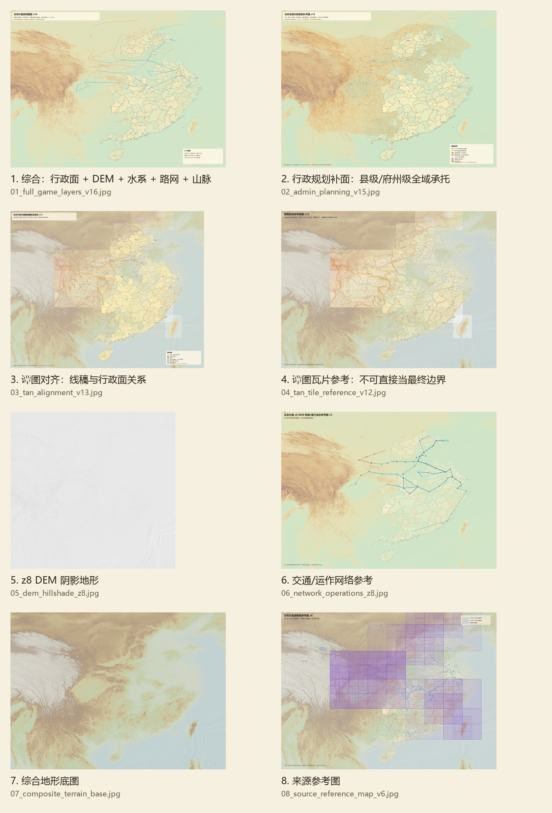

# Northern Song GIS Sandbox Package

This repository hosts the Northern Song GIS/sandbox data package.

## For Gemini / GPT / Kimi

Start here:

- `ai_art_brief/README.md`
- `ai_art_brief/ART_DIRECTION.md`
- `ai_art_brief/REQUIREMENTS_AND_LIMITS.md`
- `ai_art_brief/MODEL_HANDOFF_PROMPT.md`
- `ai_art_brief/images/00_contact_sheet.jpg`
- `ai_art_brief/images/01_full_game_layers_v16.jpg`

This is the lightweight art-direction handoff package. It explains the map direction, visual style, hard constraints, and which layers are only planning/reference layers.

Preview:

## Split Primary Layers

The most important package files have also been extracted into:

- `package_v16_primary_layers/`

Use this directory when a model or reviewer needs to inspect actual GeoJSON layers without downloading the full archive.

## Download

The full package is published as a GitHub Release asset:

- `northern_song_filled.zip`
- Release page: https://github.com/zhe9898/6/releases/tag/northern-song-v16
- Direct asset: https://github.com/zhe9898/6/releases/download/northern-song-v16/northern_song_filled.zip

The zip is intentionally kept as a single release asset because it is about 499 MB, which is larger than GitHub's normal single-file limit for files committed directly into the repository.

## Current Package

- Version: v16
- Main archive: `northern_song_filled.zip`
- Contents: administrative planning surfaces, CHGIS official prefecture polygons, gap resolution layers, hydrography reference layers, transport routes, transport nodes, named terrain calibration, Tan atlas promotion queue, DEM-derived maps, and game zoom slices.

## Notes

Planning and game-reference layers are marked with authority and confidence fields. They should not be treated as CHGIS original official boundaries unless their metadata explicitly says so.
