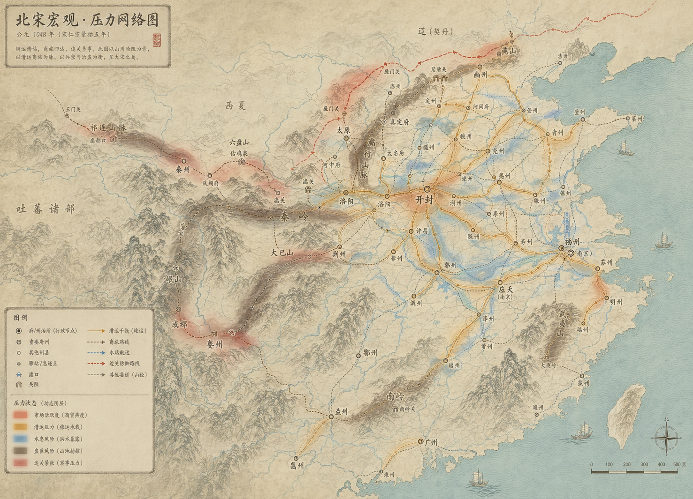

# 给 Gemini / GPT / Kimi 的北宋 2.5D 沙盘美术参考包

先看这个文件，不要从程序渲染图开始定画风：

- `STYLE_TARGET.md`

当前主方向：全国大图是宋代《华夷图》《禹迹图》式的堪舆总图，不是 2.5D DEM 浮雕图。2.5D 沙盘只进入区域/局部层。程序渲染图只能用来读数据关系，不能照画风。

当前第一美术方向样稿：

- `images/00_primary_pressure_network_kanyu_reference.png`

当前次级概念样稿：

- `images/01_style_target_pressure_network_concept.png`

注意：这些样稿是风格和压力路网样稿，不是史实定稿。不要照抄里面的地名、年份、边界和路线；用它们看“画面质量、压力覆盖层、节点路线层级、堪舆图气质”。

## 阅读顺序

1. `ART_DIRECTION.md`：图到底是什么方向，哪些层该显示。
2. `STYLE_TARGET.md`：美术主目标，明确不要做 DEM 浮雕。
3. `VISUAL_QUALITY_BAR.md`：视觉质量底线，防止做成丑的工程图。
4. `REQUIREMENTS_AND_LIMITS.md`：硬要求和禁止项。
5. `HISTORICAL_LABEL_ERRATA.md`：样张里的历史标签校正、禁用项和待校规则。
6. `MODEL_HANDOFF_PROMPT.md`：可以直接复制给 Gemini / GPT / Kimi 的任务提示词。
7. `LAYER_INDEX.md`：数据层怎么用，哪些只是参考。

## 图片入口

- `images/00_primary_pressure_network_kanyu_reference.png`：第一美术方向样稿，已把 `山海关` 改成 `榆关（待校）`，并把 `居庸关` 标成辽境压力源。
- `images/01_style_target_pressure_network_concept.png`：美术方向样稿，可以看气质和层级，不能照抄数据。
- `images/00_contact_sheet.jpg`：缩略总览。
- `images/01_full_game_layers_v16.jpg`：综合图层参考，不能照搬成全国美术图。
- `images/02_admin_planning_v15.jpg`：行政规划补面参考，只用于理解数据，不是全国美术方向。
- `images/03_tan_alignment_v13.jpg`：谭图与行政面叠合参考，用于修形和历史地图语言。
- `images/05_dem_hillshade_z8.jpg`：地形阴影参考，用于 2.5D 浮雕。
- `images/06_network_operations_z8.jpg`：交通、漕运、边防路线参考。

## 一句话方向

全国大图做“北宋华夷禹迹式山川堪舆总图”，不做 DEM 浮雕，不造县界；2.5D 沙盘只在区域/局部层进入县乡、城池、军寨、渡口、驿站和硬县界。

