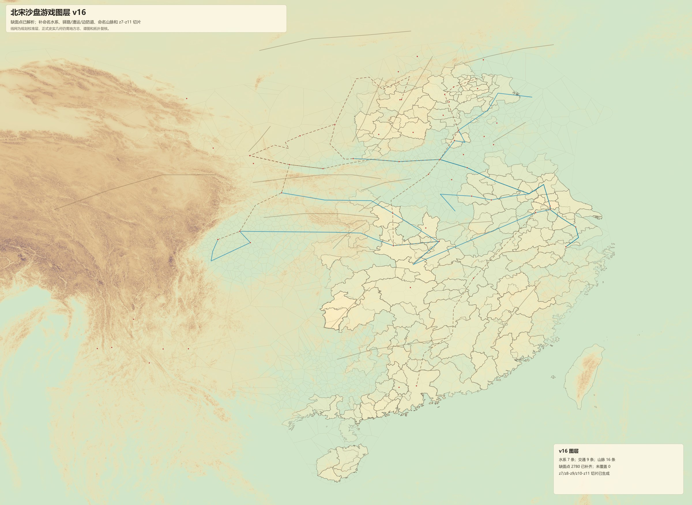

# 给 Gemini / GPT / Kimi 的北宋沙盘美术参考包

请先看这三个文件：

1. `ART_DIRECTION.md`：图是什么方向，视觉基调、视角、色彩和层级。
2. `REQUIREMENTS_AND_LIMITS.md`：必须遵守的要求和不能乱画的限制。
3. `MODEL_HANDOFF_PROMPT.md`：可以直接复制给 Gemini / GPT / Kimi 的任务提示词。

再看图片：

- `images/00_contact_sheet.jpg`：所有参考图的缩略总览。
- `images/01_full_game_layers_v16.jpg`：主参考图，优先看这一张。
- `images/02_admin_planning_v15.jpg`：行政规划补面方向。
- `images/03_tan_alignment_v13.jpg`：谭图和行政面如何叠合。
- `images/05_dem_hillshade_z8.jpg`：地形阴影方向。
- `images/06_network_operations_z8.jpg`：交通/漕运/边防路线方向。

小型图层在 `layers/`，完整主图层在仓库根目录的 `package_v16_primary_layers/`。

## 图片预览

一句话方向：

> 做“北宋行政地理沙盘”的美术基调，不做现代地图，不做泛古风海报；要像一张能放进策略游戏里的、带史料边界意识的 2.5D 地形行政参考图。
